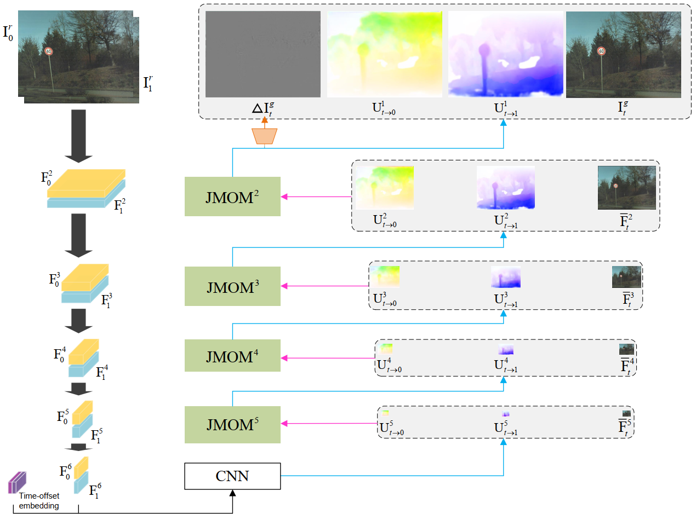
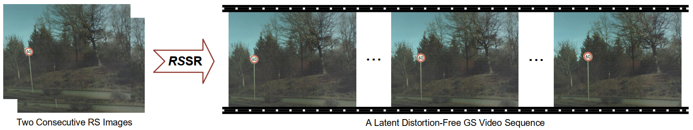

# Learning Bilateral Cost Volume for Rolling Shutter Temporal Super-Resolution

This repository contains the source code for the paper: [Learning Bilateral Cost Volume for Rolling Shutter Temporal Super-Resolution (TPAMI2024)](https://ieeexplore.ieee.org/document/10382595).

Rolling shutter temporal super-resolution (RSSR), which aims to synthesize intermediate global shutter (GS) video frames between two consecutive rolling shutter (RS) frames, has made remarkable progress with the development of deep convolutional neural networks over the past years. Existing methods cascade multiple separated networks to sequentially estimate intermediate motion fields and synthesize target GS frames. Nevertheless, they are typically complex, do not facilitate the interaction of complementary motion and appearance information, and suffer from problems such as pixel aliasing or poor interpretation. In this paper, we derive the uniform bilateral motion fields for RS-aware backward warping, which endows our network a more explicit geometric meaning by injecting spatio-temporal consistency information through time-offset embedding. More importantly, we develop a unified, single-stage RSSR pipeline to recover the latent GS video in a coarse-to-fine manner. It first extracts pyramid features from given inputs, and then refines the bilateral motion fields together with the anchor frame until generating the desired output. With the help of our proposed bilateral cost volume, which uses the anchor frame as a common reference to model the correlation with two RS frames, the gradually refined anchor frames not only facilitate intermediate motion estimation, but also compensate for contextual details, making additional frame synthesis or refinement networks unnecessary. Meanwhile, an asymmetric bilateral motion model built on top of the symmetric bilateral motion model further improves the generality and adaptability, yielding better GS video reconstruction performance. Extensive quantitative and qualitative experiments on synthetic and real data demonstrate that our method achieves new state-of-the-art results.



#  

## Installation
The code is tested with PyTorch 1.9.1 with CUDA 11.4.

Install the dependent packages:
```
pip install -r requirements.txt
```

In our implementation, we borrowed the code framework of [DeepUnrollNet](https://github.com/ethliup/DeepUnrollNet):

#### Install core package
```
cd ./package_core
python setup.py install
```

## Demo with our pretrained model
One can test our method with the provided images in the `demo` folder.

To generate the intermediate reconstruction results corresponding to the first and middle scanlines of the second rolling shutter image, simply run
```
sh demo.sh
```
To generate the latent global shutter video, simply run
```
sh demo_video.sh
```
The visualization results will be stored in the `experiments` folder. Note that additional examples can be tested similarly.

## Datasets
- **Carla-RS** and **Fastec-RS:** Download these two datasets to your local computer from [here](https://github.com/ethliup/DeepUnrollNet).
- **BS-RSC:** Download this real-world dataset to your local computer from [here](https://github.com/ljzycmd/BSRSC).

## Training and evaluating
You can run following commands to re-train the network.
```
# !! Please update the corresponding paths in 'train_carla.sh', 'train_fastec.sh' and 'train_bsrsc.sh'  #
# !! with your own local paths, before run following command!!      #

sh train_carla.sh
sh train_fastec.sh
sh train_bsrsc.sh
```

You can run following commands to obtain the quantitative evaluations.
```
# !! Please update the path to test data in 'inference.sh'
# !! with your own local path, before run following command!!

sh inference.sh
```

## Citations
Please cite our paper if necessary:
```
@article{fan2024learning,
  title={Learning Bilateral Cost Volume for Rolling Shutter Temporal Super-Resolution},
  author={Fan, Bin and Dai, Yuchao and Li, Hongdong},
  journal={IEEE Transactions on Pattern Analysis and Machine Intelligence},
  year={2024},
  volume={46},
  number={5},
  pages={3862-3879},
  publisher={IEEE}
}
```

## Statement
This project is for research purpose only, please contact us for the licence of commercial use. For any other questions or discussion please contact: binfan@mail.nwpu.edu.cn
